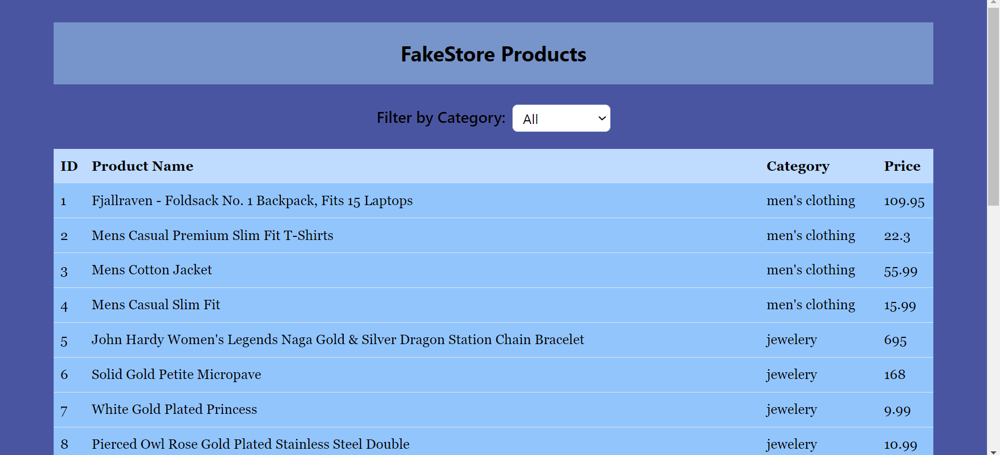

# Product List App



## Description

The Product List App is a React-based web application that displays a list of products fetched from the [FakeStore API](https://fakestoreapi.com/). Users can filter products by category and view product details such as ID, product name, category, and price in a table format.

## Features

- Fetch and display a list of products from the [FakeStore API](https://fakestoreapi.com/).
- Filter products by category.
- View product details in a table format.
- Sort products by ID and product name.

## Technologies Used

- React
- Axios for making API requests
- React-Table for displaying the product list
- Tailwind CSS for styling

## Installation

1. Clone the repository:

   ```bash
   git clone https://github.com/kratin01/Fake-Store-products-app.git